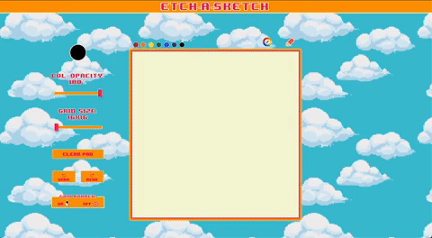

<h1 align="center">Hi 🖖🏼, I'm David Darchinian</h1>
<h3 align="center">Self-taught, passionate developer from Tbilisi, Georgia.</h3>

- 📎 Before I finish my portfolio, I will post some of my projects here

- 🌱 I’m currently learning **Full-stack development at The Odin Project**

- 👯 I’m ready to collaborate on **any front-end related project**

- 💬 I can help you with **Python, Javascript or styling**

- 📫 You can reach me at email **ddarchinian@gmail.com**

<h3 align="left">Projects:</h3>
<ul>
 
  <li><a href="https://padmed.github.io/Etch-a-Sketch-/"> 8-bit drawing tool </a> | <a href="https://github.com/padmed/Etch-a-Sketch-"> Repo</a>
      </li>
  <li><a href="https://padmed.github.io/Sign-up-Form/">Sign-Up</a> form UI | <a href="https://github.com/padmed/Sign-up-Form"> Repo</a>   </li>
 <li><a href="https://padmed.github.io/BankyUI/">Bank home page </a> UI | <a href="https://github.com/padmed/BankyUI"> Repo</a>  <iframe src="https://giphy.com/embed/A9qHQD9SZ6OZoiDbNo" width="480" height="264" frameBorder="0" class="giphy-embed" allowFullScreen></iframe>
<a href="https://giphy.com/gifs/A9qHQD9SZ6OZoiDbNo">via GIPHY</a>
</li>
</ul>

<h3 align="left">Connect with me:</h3>

<h3 align="left">Languages and Tools:</h3>

         

